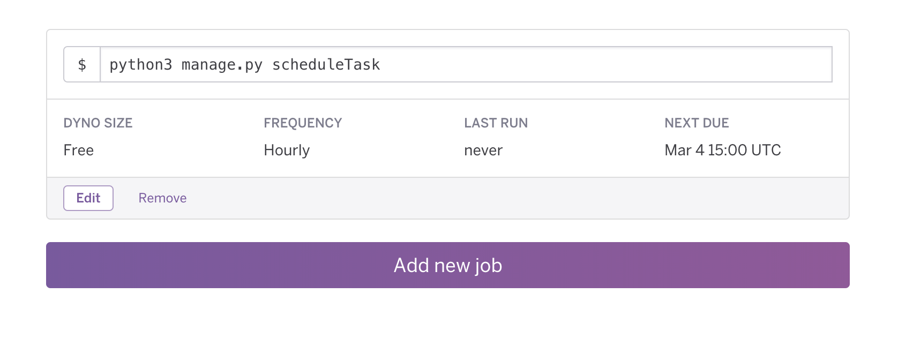

# Flask + SQLAlchemy + Heroku

A boilerplate for a flask based app with sqlalchemy and postgresql -> deploy easily on heroku

[](https://heroku.com/deploy)

## Getting started

Install the app

```bash
$ python3 -m venv venv
$ source venv/bin/activate
(venv) $ pip install -r requirements.txt
```

### Dev mode

Copy the `.env.example` to `.env`.

The default URL for the database should work by default.

Run the database + adminer :

```bash
docker-compose -f docker-compose.dev.yml up -d
```

Reset the database :

```bash
FLASK_APP=main.py flask reset_db
```

Explore the database :

- go to http://localhost:8123
    - System = Postgresql
    - Server = db # name of the service in the docker-compose
    - Username = <username>
    - Password = <password>
    - Database = <database_name>

Launch the app

```bash
FLASK_ENV=development FLASK_APP=main.py flask run
```

Try to visit http://localhost:5000/api/v1/

## Heroku

https://devcenter.heroku.com/articles/getting-started-with-python

### Run locally

```bash
# with the heroku toolbelt installed : https://devcenter.heroku.com/articles/heroku-cli
heroku local
```

### Task scheduling

Schedule a task for free every 10 minutes, every hour, or every day with heroku-scheduler :



## Todo

- Use flask-migrate (alembic)
